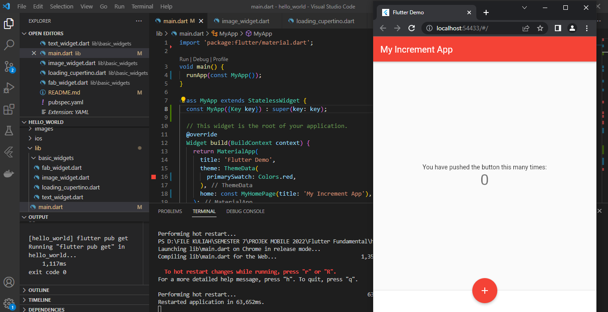
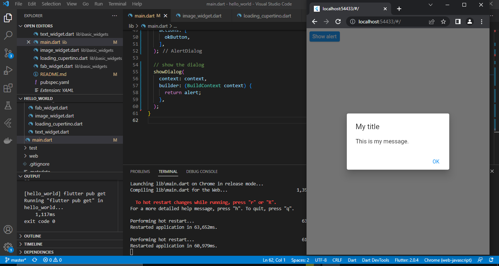
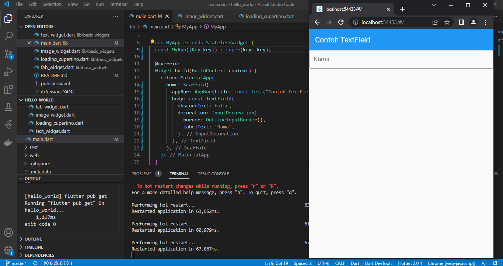
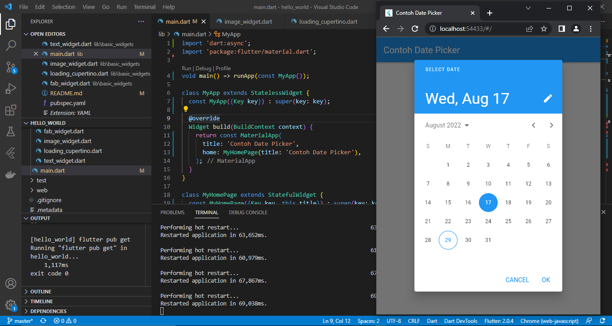

# hello_world

A new Flutter project.

1. Hasil Screenshot Praktikum 2 pada langkah 12

2. Hasil Screenshot Praktikum 3 Langkah 1 Text Widget

3. Hasil Screenshot Praktikum 3 Langkah 2 Image Widget

4. Hasil Screenshot Praktikum 4 Langkah 1 Cuppertino Button dan Loading Bar

5. Hasil Screenshot Praktikum 4 Langkah 2 Floating Action Button

6. Hasil Screenshot Praktikum 4 Langkah 3 Scaffold Widget

7. Hasil Screenshot Praktikum 4 Langkah 4 Dialog Widget

9. Hasil Screenshot Praktikum 4 Langkah 5 Input dan Selection Widget

10. Hasil Screenshot Praktikum 4 Langkah 6 Date and Time Pickers

