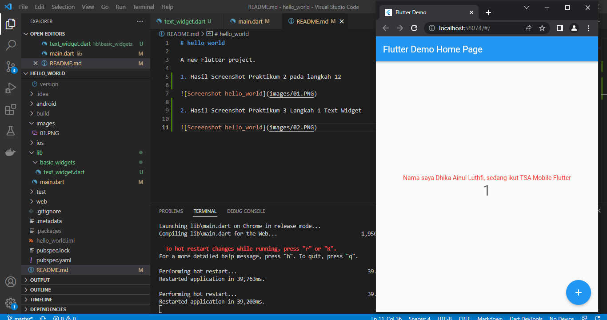
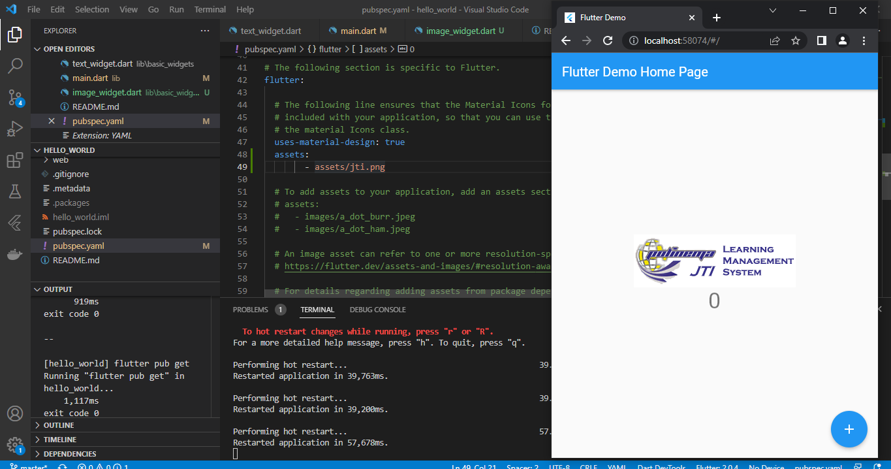
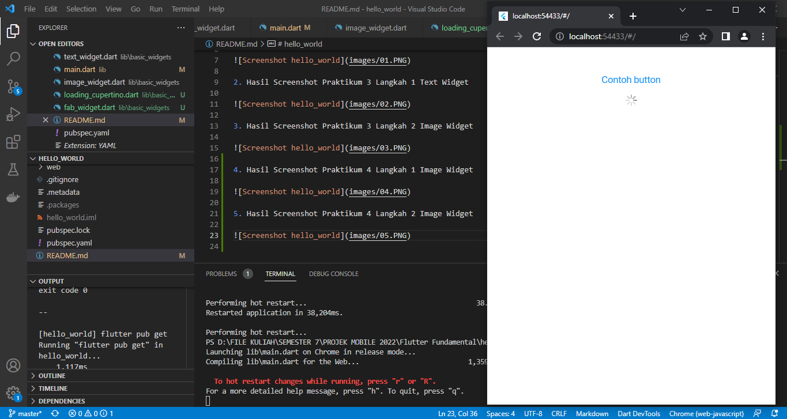
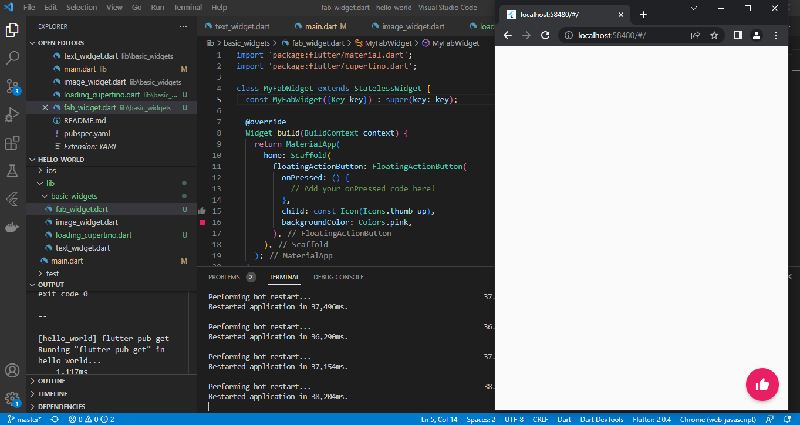

# hello_world

A new Flutter project.

1. Hasil Screenshot Praktikum 2 pada langkah 12

2. Hasil Screenshot Praktikum 3 Langkah 1 Text Widget

3. Hasil Screenshot Praktikum 3 Langkah 2 Image Widget

4. Hasil Screenshot Praktikum 4 Langkah 1 Image Widget

5. Hasil Screenshot Praktikum 4 Langkah 2 Image Widget

